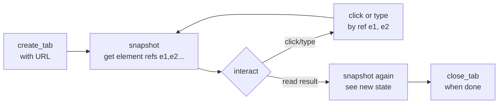

# camofox — Anti-Detection Browsing via MCP

Reaches the **camofox-browser** REST server (`localhost:9377`) through its MCP
tools (`mcp__camofox-browser__*`). Use this instead of Playwright/built-in
browser tools — Camoufox spoils fingerprints at the C++ level, so it bypasses
bot detection on Google, Cloudflare, LinkedIn, etc.

## Prerequisites

1. **camofox REST server running** — in the `camofox-browser` repo:
   ```bash
   npm install          # downloads Camoufox binary (~300MB) on first run
   npm start            # → http://localhost:9377
   ```
2. **MCP server registered in Claude Code** — see `mcp-setup.md` in this skill
   folder. Verify with `/mcp` — you should see `camofox-browser` connected.
3. If both are up, the `mcp__camofox-browser__*` tools appear automatically.

## Core workflow (almost every task)

Every camofox session follows the same shape — **snapshot before you act**:



**Critical rule**: never guess selectors. Always `snapshot` first to get the
`e1`, `e2` element refs, then pass that ref to `click`/`type`. Refs are stable
within a tab until the page navigation changes them — re-snapshot after any
`navigate`.

## Available tools (`mcp__camofox-browser__*`)

| Tool | When |
|------|------|
| `camofox_create_tab` | Open a URL → returns `tabId` |
| `camofox_snapshot` | Read page state + element refs (+ screenshot). Paginate with `offset` when `hasMore=true` |
| `camofox_navigate` | Go to URL **or** use search macro (`@google_search`, `@reddit_search`, ...) |
| `camofox_click` | Click by ref (`e1`) or CSS selector |
| `camofox_type` | Type text into a ref/selector, optional `pressEnter` |
| `camofox_scroll` | up/down/left/right by pixels |
| `camofox_screenshot` | Standalone screenshot (snapshot already includes one) |
| `camofox_evaluate` | Run JS in page context — extract data, call page APIs |
| `camofox_list_tabs` | See what's open in this session |
| `camofox_close_tab` | Free resources when done |
| `camofox_import_cookies` | Authenticate via Netscape cookie file (needs `CAMOFOX_API_KEY`) |

## Recipes

### Web search (one call via macro)
```
create_tab({ url: "about:blank" })          → tabId
navigate({ tabId, macro: "@google_search", query: "rust async runtime" })
snapshot({ tabId })                          → read result refs
```

### Extract structured data from a page
```
create_tab({ url: "https://example.com/products" })
snapshot({ tabId })                          → locate items
evaluate({ tabId, expression: `
  Array.from(document.querySelectorAll('.product')).map(p => ({
    name: p.querySelector('.name')?.textContent,
    price: p.querySelector('.price')?.textContent,
  }))
` })
```

### Login via cookies (LinkedIn etc.)
```
import_cookies({ cookiesPath: "/path/to/cookies.txt", domainSuffix: "linkedin.com" })
create_tab({ url: "https://linkedin.com/feed" })
snapshot({ tabId })                          → authenticated view
```

### Paginate a huge page
```
snapshot({ tabId })           → hasMore:true, nextOffset:12345
snapshot({ tabId, offset: 12345 })   → next chunk
```

## When NOT to use this skill

- **Writing/analysis tasks** that only need fetched text → use `agent-reach`
  or `WebFetch` (lighter, no browser).
- **Internal/test pages with no bot detection** → plain Playwright is faster.
- **Posting/commenting/liking** → camofox is read + interact; don't automate
  spammy write actions.

## Troubleshooting

- **`MCP tool not found`** → server not registered; run `/mcp` and check
  `mcp-setup.md`.
- **`503 session_expired` / `tab create timed out`** → the REST server's
  browser session died. Restart `npm start`, or check `BROWSER_IDLE_TIMEOUT_MS`
  isn't too aggressive.
- **`400 userId and sessionKey required`** → MCP wrapper bug (should send both).
  Confirm you're on a build that includes the `sessionKey` fix.
